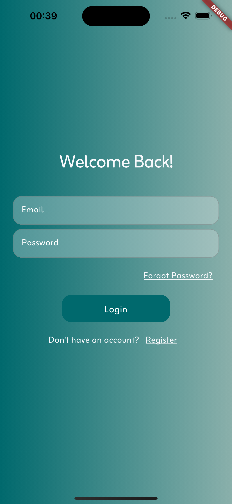
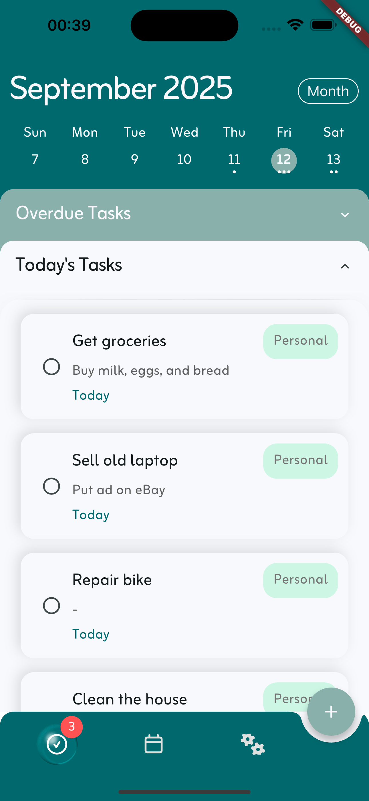

# Syncly

Syncly is a free, open-source notes and tasks app built with **Flutter**. It works offline-first, syncs across devices, and emphasizes user privacy — no ads, no trackers.

## Features

- Rich notes — create and manage notes
- Reminders — scheduled notifications
- Cross-platform — Android, iOS, Web
- Offline-first — full functionality without network
- Sync (planned) — secure cloud sync via a self-hosted backend
- Custom themes — light/dark mode
- Privacy-first — literally no data collection; all synced data is encrypted end-to-end

## Tech Stack

- **Frontend:** Flutter (Riverpod for state management)  
- **Local storage:** Drift (SQLite ORM)  
- **Sync backend:**  
  - Development: Supabase  
  - Production: Planned to self-hosted backend (VPS)
- **Routing:** GoRouter  
- **Architecture:** Clean Architecture (feature-based + core/shared modules)

## Screenshots





## Project Structure

```
lib/
├── core/                # Shared utilities, theme, widgets
│   ├── errors/
│   ├── usecases/
│   ├── utils/
│   └── theme/
├── features/
│   └── notes/
│       ├── data/
│       │   ├── datasources/
│       │   │   ├── local/   # Drift implementation
│       │   │   └── remote/  # Supabase / VM implementation
│       │   ├── models/      # DTOs, serializable models
│       │   └── repositories_impl/
│       ├── domain/
│       │   ├── entities/    # Note, Reminder entities
│       │   ├── repositories/# Abstract repository interfaces
│       │   └── usecases/    # Business logic
│       └── presentation/
│           ├── providers/   # Riverpod providers
│           ├── pages/       # Screens
│           └── widgets/     # Feature-specific widgets
├── app.dart              # App widget & router setup
└── main.dart             # Entry point
```

## Getting Started

### Prerequisites
- [Flutter SDK](https://flutter.dev/docs/get-started/install) (stable)  
- IDE: VS Code or Android Studio

### Clone the Repository
```bash
git clone https://github.com/snowyvibes/syncly.git
cd syncly
```

### Install Dependencies
```bash
flutter pub get
```

### Run the App
```bash
flutter run
```

## Contributing

Contributions are welcome. Please open an issue before submitting a PR so we can discuss changes and align on scope and design.

## License

This code is provided for educational and transparency purposes only.

You may read and contribute to this repository, but you may not reuse, modify, or redistribute any part of the code for your own projects or commercial purposes.

See the [LICENSE](./LICENSE) file for full details.

## Privacy

Syncly is built with privacy in mind:

- Literally no data collection  
- No third-party tracking
- All synced data is encrypted end-to-end before leaving the device
- User data stays on-device unless the user enables sync
